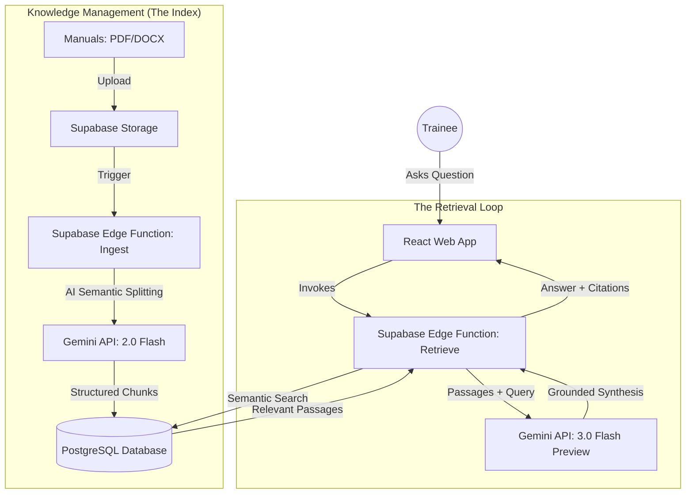

# ClaimSense AI: Architecture & RAG Strategy

ClaimSense AI is not just a "normal chatbot"—it is a **Retrieval-Augmented Generation (RAG)** system. While it uses the Gemini API for "thinking," its primary value comes from the specific insurance manuals you provide.

## Why use this instead of a standard chatbot?

| Feature | Standard Chatbot (e.g., ChatGPT/Gemini) | ClaimSense AI (RAG) |
| :--- | :--- | :--- |
| **Source of Truth** | General training data (outdated or unknown). | **Your specific company manuals.** |
| **Accuracy** | May "hallucinate" (invent plausible-sounding rules). | **Grounded** only in the provided text. |
| **Verification** | Difficult to verify where an answer came from. | **Inline citations** (e.g., [#1]) with direct excerpts. |
| **Proprietary Info** | Doesn't know your internal policies. | Securely indexes your private documents. |

---

## Technical Architecture

The system is built on a modern stack designed for speed and reliability.

### 1. The "Ingest" Phase (Semantic Indexing)
When a manual is uploaded:
- The system doesn't just store the file. It uses **Gemini 2.0 Flash** to read the document and split it into "chunks."
- It identifies headings, sections (e.g., "Sec 4.A"), and page numbers.
- These chunks are stored in your database so they can be searched instantly.

### 2. The "Retrieve" Phase (The Search)
When a trainee asks a question (e.g., *"What documentation is needed for a theft claim?"*):
- The system searches the database for the most relevant passages.
- It doesn't just find keywords; it finds the *meaning* of the question.
- It pulls the top 4-5 most relevant passages from your manuals.

### 3. The "Generation" Phase (Grounded Answer)
- The system sends a "Context Window" to **Gemini 3.0 Flash Preview**.
- It tells the AI: *"Using ONLY these 5 passages from our manual, answer the trainee's question. Use citations [#n] and do not invent information."*
- Gemini synthesizes the answer, and the app displays the specific manual excerpts used so the trainee can verify the source.

## Conclusion: Why for ClaimSense?
Insurance claim processing is a high-precision field. A "normal" chatbot might give a plausible answer that is slightly wrong regarding a specific state's 2024 policy. **ClaimSense AI** ensures that trainees are learning from the **actual source text**, reducing company liability and ensuring training consistency across the group.
